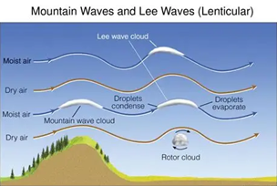
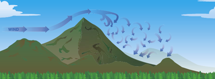

# Orographic Wind Subsystem (OWS)  
Processing‑Ordered Specification  
Far‑Field Orographic Wind Effects  
(Mountain Waves + Rotor Envelopes + Divergence Envelope)

OWS computes **far‑field terrain‑induced wind phenomena** that occur on
10–50 km horizontal scales — too large for Terrain Wind (1–5 km) and too small for Synoptic Wind (10–1000 km).

OWS produces **deterministic envelopes only**.  
OWS does **not** generate oscillations or turbulence.  
OWS does **not** apply blending.  
Blending and turbulence modulation are applied later by the **Wind Aggregator** and **Turbulence** subsystems.

OWS uses **Synoptic Wind subsystem datarefs** as its atmospheric driver.  
It does **not** read XP12’s raw weather arrays.

OWS evaluates its output at XP12’s altitude levels **to align with Synoptic Wind and Wind Aggregator**.

---

# 1. Inputs

## 1.1 Atmospheric Inputs (From Synoptic Wind Subsystem)

### Synoptic Wind (profile arrays at XP12 altitude levels)
- wind_syn_profile_x_msc[i]  
- wind_syn_profile_y_msc[i]  
- wind_syn_profile_z_msc[i] (optional)

Wind speed:

\[
U(z_i) = \sqrt{wind\_syn\_profile\_x[i]^2 + wind\_syn\_profile\_y[i]^2}
\]

Wind direction:

\[
\theta_{wind}(z_i) = \text{atan2}(wind\_syn\_profile\_y[i],\; wind\_syn\_profile\_x[i])
\]

### Synoptic Wind (derived fields)
- wind_syn_stability_msc[i]  
- wind_syn_shear_msc[i]

### XP12 Altitude Grid (evaluation only)
- `sim/weather/region/atmosphere_alt_levels_m[i]`

---

## 1.2 Terrain Geometry (Regional Scale)
- Ridge height H_ridge  
- Ridge width W_ridge  
- Ridge orientation θ_ridge  
- Upwind/downwind terrain cross‑sections (10–50 km)  
- Regional terrain curvature:

\[
C_{reg} = \frac{\partial^2 z}{\partial x^2} + \frac{\partial^2 z}{\partial y^2}
\]

---

## 1.3 Aircraft Inputs
- Aircraft position (lat/lon/alt)  
- Horizontal distance x from ridge line (signed)

---

# 2. Pre‑Computations

## 2.1 Wind–Ridge Perpendicular Component

\[
U_{\perp}(z_i) = U(z_i) \cdot \sin(\theta_{wind}(z_i) - \theta_{ridge})
\]

## 2.2 Stability

\[
N(z_i) = wind\_syn\_stability\_msc[i]
\]

## 2.3 Shear

\[
S(z_i) = wind\_syn\_shear\_msc[i]
\]

## 2.4 Wave Trigger Condition

\[
U_{\perp}(z_i) > U_{min},\quad N(z_i) > N_{min},\quad H_{ridge} > H_{min}
\]

---

# 3. Mountain Wave Envelope

## 3.1 Wavelength

\[
\lambda(z_i) = \frac{2\pi U_{\perp}(z_i)}{N(z_i)}
\]

## 3.2 Amplitude

\[
A_{wave}(z_i) = k_w \cdot H_{ridge} \cdot \frac{U_{\perp}(z_i)}{N(z_i)}
\]

## 3.3 Envelope Output
OWS publishes the deterministic wave envelope at aircraft altitude:

- wind_orographic_wave_x_msc  
- wind_orographic_wave_y_msc  
- wind_orographic_wave_z_msc  

These represent the **peak** ΔV components, not the oscillation.

**Optional (recommended for Turbulence):**
- wind_orographic_wavelength_msc = λ(z_at_aircraft)

---

# 4. Rotor Envelope

Rotors form when:

\[
A_{wave}(z_i) > A_{crit}
\]

Rotor strength:

\[
R(z_i) = k_r \cdot A_{wave}(z_i)
\]

OWS publishes the deterministic rotor envelope:

- wind_orographic_rotor_x_msc  
- wind_orographic_rotor_y_msc  
- wind_orographic_rotor_z_msc  

These represent the **peak** rotor ΔV components.

---

# 5. Divergence Envelope (Far‑Field)

Regional curvature drives large‑scale flow splitting and focusing.

Divergence amplitude envelope:

\[
A_{div}(z_i) = k_{div} \cdot C_{reg} \cdot U_{\perp}(z_i)
\]

OWS does **not** generate the rolling oscillation.  
It publishes only the deterministic envelope:

- wind_orographic_divergence_msc = A_div(z_at_aircraft)

The **Turbulence subsystem** consumes this envelope and generates the rolling divergence turbulence field.

---

# 6. Evaluation at XP12 Altitude Levels  
(Alignment with Synoptic Wind + Wind Aggregator)

For each XP12 altitude level:

\[
z_i = \text{atmosphere\_alt\_levels\_m}[i]
\]

OWS computes envelopes at these levels, then extracts the value at aircraft altitude.

OWS does **not** apply blending.  
Blending is performed by the **Wind Aggregator**.

---

# 7. Output (Registered Datarefs Only)

All outputs are **scalars** at aircraft altitude:

| Dataref Name                       | Type  | Description                                           | Elements |
|------------------------------------|-------|-------------------------------------------------------|----------|
| wind_orographic_wave_x_msc         | float | Mountain‑wave envelope, X component                   | scalar   |
| wind_orographic_wave_y_msc         | float | Mountain‑wave envelope, Y component                   | scalar   |
| wind_orographic_wave_z_msc         | float | Mountain‑wave envelope, Z component                   | scalar   |
| wind_orographic_rotor_x_msc        | float | Rotor envelope, X component                           | scalar   |
| wind_orographic_rotor_y_msc        | float | Rotor envelope, Y component                           | scalar   |
| wind_orographic_rotor_z_msc        | float | Rotor envelope, Z component                           | scalar   |
| wind_orographic_divergence_msc     | float | Divergence envelope (scalar amplitude for turbulence) | scalar   |
| wind_orographic_wavelength_msc     | float | (Optional) Mountain‑wave vertical wavelength (m)      | scalar   |

These are consumed by:

- **Turbulence subsystem** (divergence + wave + rotor envelopes)  
- **Wind Aggregator** (wave + rotor envelopes)

OWS **never** writes XP12 wind datarefs.

---

# 8. Notes

- OWS is **deterministic**: envelopes only.  
- Turbulence subsystem generates **rolling divergence** and **wave oscillations** using the envelopes.  
- Terrain Wind handles **near‑field** effects (1–5 km).  
- OWS handles **far‑field** effects (10–50 km).  
- Synoptic Wind handles **global/regional** winds (10–1000 km).  
- Wind Aggregator performs the final combination and XP12 injection.  
