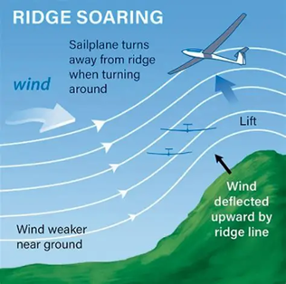
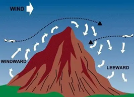
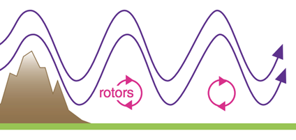
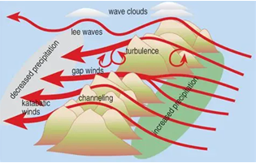

# Terrain Wind Subsystem  
Deterministic Near‑Field Terrain‑Induced Wind Effects  
(Ridge, Lee, Rotors, Valley Channeling, Convergence)

Terrain Wind computes **near‑field** wind modifications caused by terrain geometry within 1–5 km of the aircraft.  
It produces **ΔV_terrain** and does **not** apply blending.  
Blending is applied later by the **Wind Aggregator** using **Surface Wind’s blending fields**.

Terrain Wind uses the **Synoptic Wind subsystem outputs** as its atmospheric driver.  

Terrain Wind also publishes a **deterministic rotor envelope** for the Turbulence subsystem,  
which generates the *rolling rotor turbulence* using this envelope.

---

# 1. Inputs

## 1.1 Terrain Geometry (from X‑Plane DSF Mesh)
- Terrain elevation grid \( z(x,y) \)

Local slope magnitude:


\[
s = |\nabla z| = \sqrt{\left(\frac{\partial z}{\partial x}\right)^2 + \left(\frac{\partial z}{\partial y}\right)^2}
\]


Slope aspect:


\[
\theta_{slope} = \arctan2\left(\frac{\partial z}{\partial y}, \frac{\partial z}{\partial x}\right)
\]


Terrain curvature:


\[
C = \frac{\partial^2 z}{\partial x^2} + \frac{\partial^2 z}{\partial y^2}
\]


Additional geometry:
- Ridge lines (negative curvature + steep slope)  
- Valleys (positive curvature)  
- Gap / pass geometry (saddle points)  
- Upwind/downwind height differences  

---

## 1.2 Atmospheric Inputs (From Synoptic Wind Subsystem)

### Synoptic Wind (baseline at aircraft altitude)
- wind_syn_x_msc  
- wind_syn_y_msc  
- wind_syn_z_msc (optional)

Wind speed:


\[
U = \sqrt{wind\_syn\_x^2 + wind\_syn\_y^2}
\]


Wind direction:


\[
\theta_{wind} = \text{atan2}(wind\_syn\_y,\; wind\_syn\_x)
\]


### Synoptic Wind (profile arrays — optional for vertical decay)
- wind_syn_profile_x_msc[i]  
- wind_syn_profile_y_msc[i]  
- wind_syn_profile_z_msc[i]

### Synoptic Wind (derived fields — optional)
- wind_syn_stability_msc[i]  
- wind_syn_shear_msc[i]

---

## 1.3 Aircraft Inputs
- True Airspeed \( V_{TAS} \)  
- Aircraft position (lat/lon/alt)  
- AGL (for vertical decay)  

---

# 2. World‑Aligned Ray Sampling Box (Near‑Field Only)

Terrain Wind uses a **fixed, level, world‑aligned sampling box** centered on the aircraft.  
Rays do **not** rotate with aircraft pitch/roll/yaw.


```
        N
        ^
   NW   |   NE
     \     /
W <---- + ----> E
     /     \
   SW   |   SE
        v
        S

     ____/^^^^^\____
```


---

## 2.1 Speed‑Relative Ray Length (Near‑Field)

Horizontal ray length:


\[
L_{\text{near}} = \text{clamp}(V_{\text{TAS}} \cdot T,\; 1000,\; 5000)
\]


Look‑ahead time \(T\):

| Aircraft Type        | Look‑Ahead Time |
|----------------------|-----------------|
| Slow GA / Heli       | 10 s            |
| Fast GA / Turboprop  | 15 s            |
| Jet / Airliner       | 20 s            |

---

## 2.2 Ray Set (10 Rays Total)

### Vertical Rays  
- Up: (0, +1, 0), length 2 km  
- Down: (0, −1, 0), length 1.5 km or until terrain hit  

### Horizontal Cardinal Rays  
- N, S, E, W — length = \( L_{\text{near}} \)

### Horizontal Diagonal Rays  
- NE, NW, SE, SW — length = \( L_{\text{near}} \)

---

## 2.3 Slope Computation Along Rays

Ray slope:


\[
s_{ray} = \frac{z_0 - z_k}{L_{\text{near}}}
\]


Combined effective slope:


\[
s_{eff} = \alpha \cdot s_{ray} + (1 - \alpha) \cdot s
\]


Typical \( \alpha = 0.6 \).

Wind–slope alignment:


\[
\Delta \theta = \theta_{wind} - \theta_{slope}
\]


\[
A = \cos(\Delta \theta)
\]


Final aligned slope:


\[
s_{eff} = s_{eff} \cdot A
\]


---

# 3. Vertical Decay With Height


\[
w_{terrain}(h) = e^{-h / H_t}
\]


Typical \( H_t = 600 \) m.

---

# 4. Terrain Wind Physics (Near‑Field Only)

 

 

---

## 4.1 Ridge Lift  


\[
W_{ridge} = U \cdot s_{eff}
\]


\[
\Delta V_{ridge,z} = W_{ridge} \cdot S_{ridge} \cdot w_{terrain}(h)
\]


---

## 4.2 Lee‑Side Sink  


\[
D_{lee} = -U \cdot s_{eff}
\]


\[
\Delta V_{lee,z} = D_{lee} \cdot S_{lee} \cdot w_{terrain}(h)
\]


---

## 4.3 Rotor Zones (Near‑Field Deterministic Component)

Rotor strength:


\[
R = k_r \cdot U \cdot s_{eff}
\]


Vertical rotor:


\[
\Delta V_{rotor,z} = R \cdot \sin\left(\frac{2\pi x}{L_r}\right) \cdot w_{terrain}(h)
\]


Horizontal rotor:


\[
\Delta V_{rotor,x} = R \cdot \cos\left(\frac{2\pi x}{L_r}\right) \cdot w_{terrain}(h)
\]


### Rotor Turbulence Envelope (Published for Turbulence Subsystem)


\[
A_{rotor} = R
\]


Published as:
- wind_terrain_rotor_envelope_msc

This is **not** applied directly to ΔV_terrain.  
It is consumed by the **Turbulence subsystem** to generate **rolling rotor turbulence**.

---

## 4.4 Valley Channeling  


\[
\gamma = \frac{A_{upwind}}{A_{valley}}
\]


\[
\Delta V_{valley} = U \cdot (\gamma - 1)
\]


---

## 4.5 Terrain‑Induced Convergence/Divergence  


\[
C_v = -C
\]


\[
\Delta V_{conv} = k_v \cdot C_v \cdot U \cdot w_{terrain}(h)
\]


---

# 5. Final ΔV_terrain


\[
\Delta \vec{V}_{terrain} =
\Delta \vec{V}_{ridge}
+ \Delta \vec{V}_{lee}
+ \Delta \vec{V}_{rotor}
+ \Delta \vec{V}_{valley}
+ \Delta \vec{V}_{conv}
\]


Terrain Wind applies **no blending**.  
Blending is performed by the **Wind Aggregator** using Surface Wind’s blending fields.

---

# 6. Output (Registered Datarefs Only)

| Dataref Name                      | Type  | Description                                              | Elements |
|-----------------------------------|-------|----------------------------------------------------------|----------|
| wind_terrain_x_msc                | float | ΔV_terrain contribution in X direction                   | scalar   |
| wind_terrain_y_msc                | float | ΔV_terrain contribution in Y direction                   | scalar   |
| wind_terrain_z_msc                | float | ΔV_terrain contribution in Z direction                   | scalar   |
| wind_terrain_rotor_envelope_msc   | float | Deterministic rotor amplitude for Turbulence subsystem   | scalar   |

Terrain Wind **never** writes XP12 wind datarefs.  
Only the **Wind Aggregator** writes XP12 wind datarefs.

---

# 7. Architectural Notes

- Terrain Wind handles **near‑field** terrain effects (1–5 km).  
- Orographic Wind handles **far‑field** terrain effects (10–50 km).  
- Synoptic Wind provides the **baseline atmosphere**.  
- Surface Wind provides **blending fields** and **gust envelope**.  
- Wind Aggregator performs **all blending** and **all XP12 wind writes**.  
- Turbulence subsystem consumes **rotor envelope** and other envelopes to generate stochastic forces.
